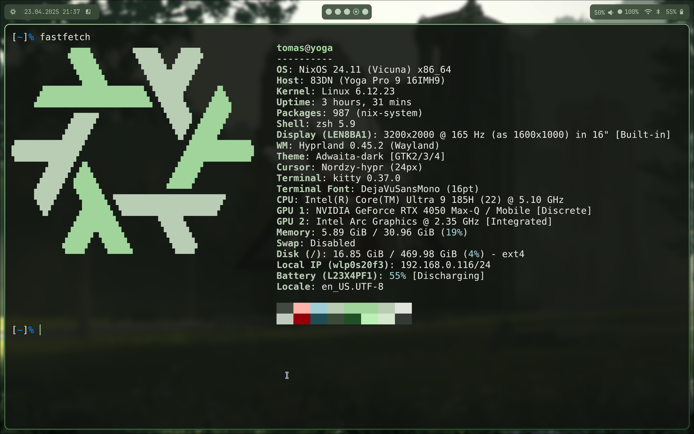

# ❄️ Zloutek1's NixOS & Home-Manager Configuration

Minimal. Modern. Personal.



# Hosts

## **Lenovo Yoga Pro 9 16IMH9**

- **CPU:** Intel Core i9-13905H (14-core)
- **GPU:** NVIDIA GeForce RTX 4050 (dGPU) + Intel Iris Xe (iGPU)
- **Display:** 3.2K 165Hz IPS (4096x2560)
- **WM:** Hyprland (Wayland)
- **DE:** None (minimal)
- **Boot:** GRUB
- **Usage:** Primary workstation for dev, writing, and experiments


# Users

### tomas
- **Shell:** `zsh`
- **Editor:** `neovim`
- **Terminal:** `kitty`
- **Theme:** Dynamic (from wallpaper with `matguen`)
- **Fonts:** JetBrainsMono Nerd Font
- **Browser:** Chromium
- **Bar:** `watbar`
- **Launcher:** `rofi`

# Features

- Declarative NixOS configuration using flakes
- Home Manager integration with modular setup
- Hyprland on Wayland with dynamic theming
- Dynamic theming based on wallpaper using Matugen
- Hardware Optimizations for Lenovo Yoga 16IMH9

## Structure

```bash
.
├── flake.nix         # Entry point for the configuration
├── homes/            # Home-manager configurations
├── hosts/            # Machine-specific configurations
├── lib/              # Helper functions and utilities
├── modules/          # Reusable configuration modules
│   ├── hardware/     # Hardware-specific configurations
│   ├── home-manager/ # User environment modules
│   └── nixos/        # System-level modules
└── pkgs/             # Custom packages
```

## Theming

Wallpapers are managed with a custom `wallchange` script that integrates with [matguen](https://github.com/matguen/matguen) to generate a dynamic GTK and terminal color scheme on each wallpaper change.

Scripts available:
- `wallchange`: Switch to the previous/next/random wallpaper and update themes
- `pick-wallpaper`: Open a selector to choose a specific wallpaper
- `update-colors`: Regenerate theme colors from the current wallpaper

## Keyboard Shortcuts

The following are the shortucts used in my system. (Super is windows key)

| Keybind | Action |
|--------|--------|
| <kbd>Super</kbd> + <kbd>Return</kbd> | Launch terminal (`kitty`) |
| <kbd>Super</kbd> + <kbd>F2</kbd> | Launch browser (`chromium`) |
| <kbd>Super</kbd> + <kbd>Shift</kbd> + <kbd>Q</kbd> | Close focused window |
| <kbd>Super</kbd> + <kbd>D</kbd> | Show app launcher (`rofi`) |
| <kbd>Super</kbd> + <kbd>E</kbd> | Launch file manager (`nautilus`) |
| <kbd>Super</kbd> + <kbd>Space</kbd> | Switch keyboard layout |
| <kbd>Print</kbd> | Screenshot (full) via `hyprshot` |
| <kbd>Super</kbd> + <kbd>Print</kbd> | Screenshot (area) via `hyprshot` |
| <kbd>Super</kbd> + <kbd>F</kbd> | Toggle fullscreen |
| <kbd>Super</kbd> + <kbd>[1-9]</kbd> | Switch workspace |
| <kbd>Super</kbd> + <kbd>Shift</kbd> + <kbd>[1-9]</kbd> | Move window to workspace |

## 🙏 Acknowledgments

- [NixOS](https://nixos.org/) for the amazing Linux distribution
- [Home Manager](https://github.com/nix-community/home-manager) for user environment management
- [Hyprland](https://hyprland.org/) for the excellent Wayland compositor
- [JaKooLit Hyprland Dots](https://github.com/JaKooLit/Hyprland-Dots/releases) for wallpaper select rofi theme
- [Adi1090x Rofi Dots](https://github.com/adi1090x/rofi) for Rofi launcher theme
- [maximmaxim345's Scripts](https://github.com/maximmaxim345/yoga_pro_9i_gen9_linux) for Lenovo Yoga 9i linux fixes
- [alyraffauf's Nix Dots](https://github.com/alyraffauf/nixcfg/tree/master) for Lenovo Yoga 9i fixes.
- Various open-source project contributors that made this configuration possible